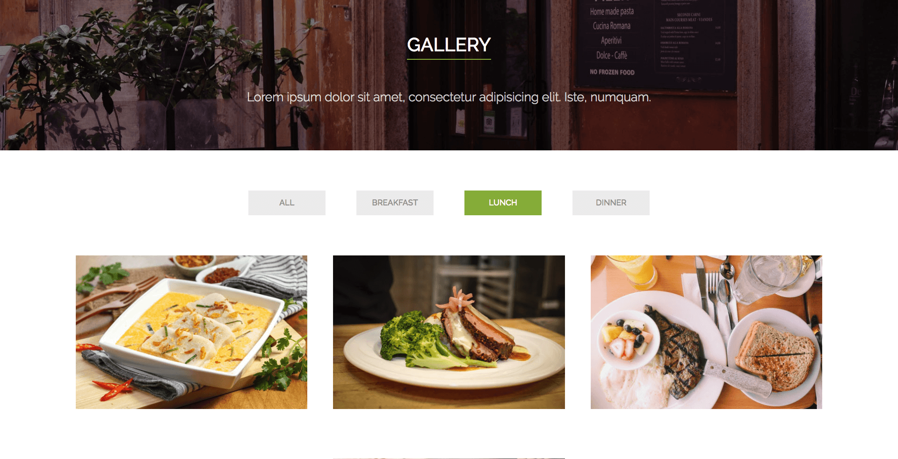

# Touché  
**Live App** : [https://terrancecorley.com/touche](https://terrancecorley.com/touche)

## Summary  

Touché is a mock static website I created aimed at restaurant owners of any size. It feautures a modern design with a single page interface.

## Screenshots

### Site Header

  
### Menu 

### Menu Gallery

### Chef Images

## Tech Stack  

Touché was created with the following languages:

**Client**: JavaScript, CSS3, HTML5

**Deployment**: GitHub Pages
